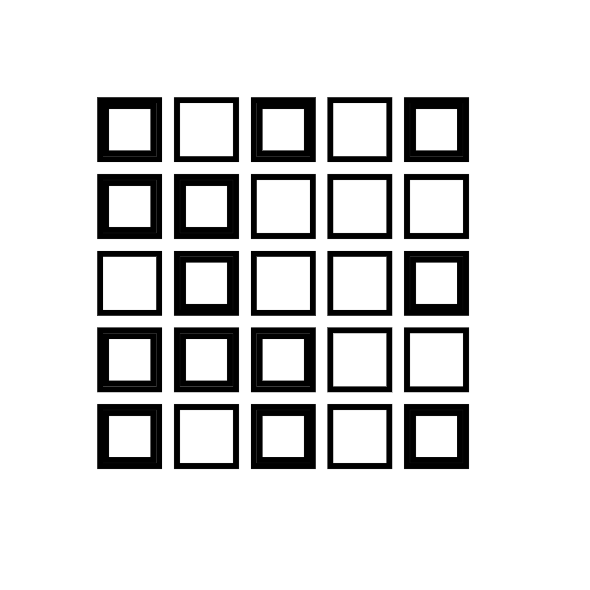

# Creative Coding: Making Visuals with JavaScript

Online course available at: [Creative Coding: Making Visuals with JavaScript](https://www.domestika.org/en/courses/2729-creative-coding-making-visuals-with-javascript)

```sh
# To launch browser, run in terminal:
canvas-sketch file-name.js --open

#To assign output folder for screenshots:
canvas-sketch file-name.js --output=[folder path]
```

## Tool Stack

- [canvas-sketch:](https://github.com/mattdesl/canvas-sketch) A framework for making generative artwork in JavaScript and the browser.
- [canvas-sketch-util:](https://github.com/mattdesl/canvas-sketch-util) A library of utility functions for generative art in Canvas, WebGL and JavaScript, designed to be used alongside the canvas-sketch toolset, but generic enough to work for various Node.js/browser use cases.
- [CanvasRenderingContext2D MDN](https://developer.mozilla.org/en-US/docs/Web/API/CanvasRenderingContext2D#transformations)
- [HTML Canvas Reference](https://www.w3schools.com/tags/ref_canvas.asp)
- [npm v8.11.0](https://www.npmjs.com/package/npm/v/8.11.0)
- [node v16.16.0](https://nodejs.org/en/blog/release/v16.16.0)

## Sample Sketches

### [Sketch 01](./sketches/sketch-01.js)

<p align="center">
  
  
</p>

### [Sketch 02](./sketches/sketch-02.js)

<p align="center">
  
  
</p>
