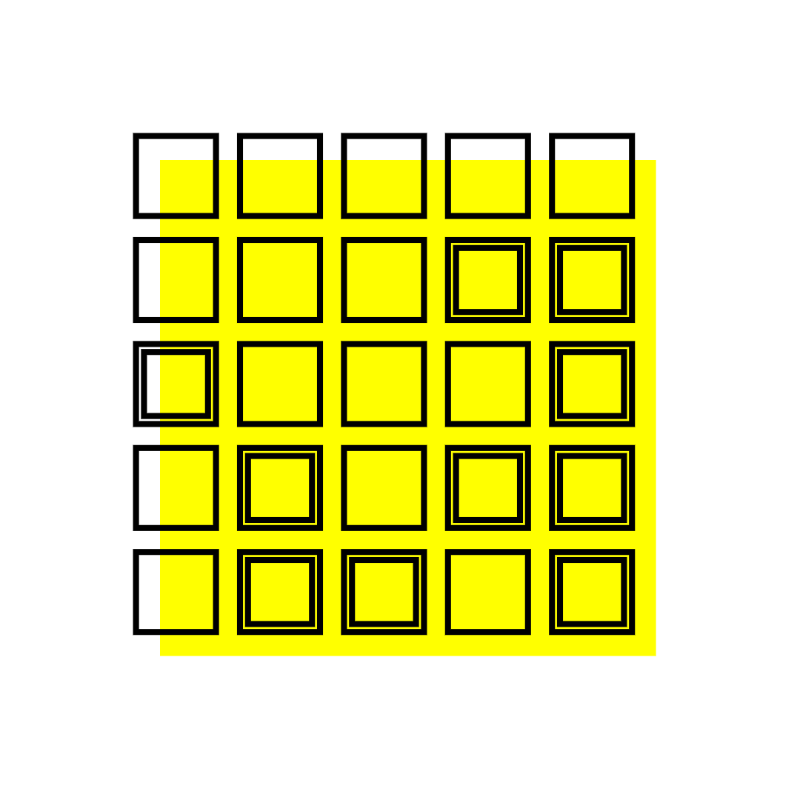
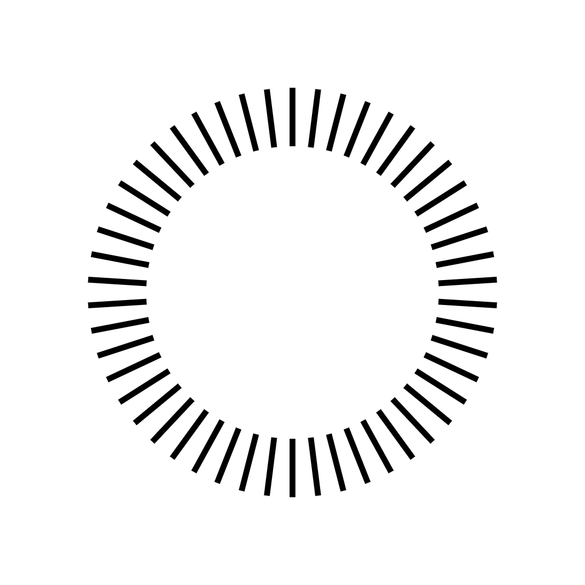

# Creative Coding: Making Visuals with JavaScript

Online course available at: [Creative Coding: Making Visuals with JavaScript](https://www.domestika.org/en/courses/2729-creative-coding-making-visuals-with-javascript)

## Sample Sketches

### [Sketch 01](./sketches/sketch-01.js)

  
  

### [Sketch 02](./sketches/sketch-02.js)

  
  

